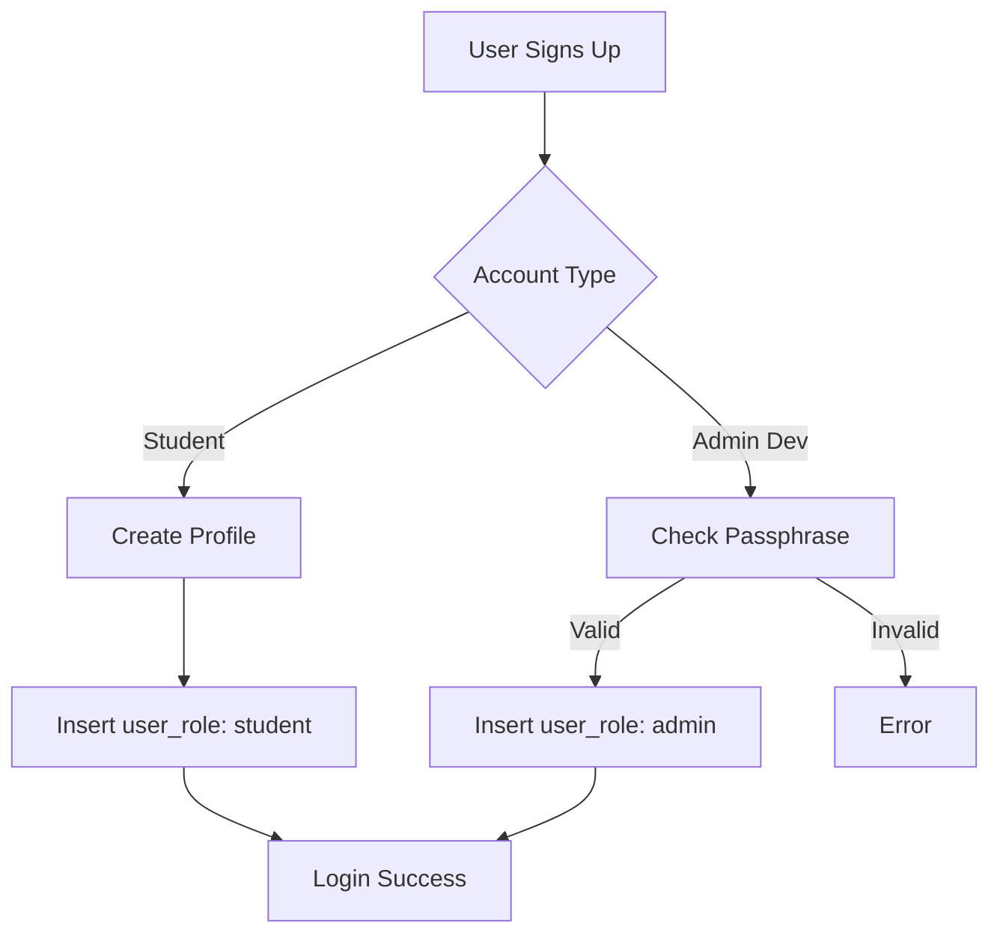

# Phase 1: Authentication & Role-Based Access Control

## ✅ Completed Features

### 1. Authentication System
- **Login Page** (`/login`) - Email/password authentication
- **Student Signup** (`/signup`) - Full registration form with validation
- **Admin Signup** (`/signup/admin`) - Restricted admin account creation
- **Profile Page** (`/profile`) - View user profile and account details
- **Protected Routes** - Automatic redirect to login for unauthenticated users

### 2. Role-Based Access Control (RBAC)
- **Three User Roles**: Admin, Teacher, Student
- **Role Storage**: Separate `user_roles` table (security best practice)
- **Role-Aware UI**: Different navigation and features based on role
- **Protected Routes**: Enforce role requirements at route level

### 3. Database Schema
- **profiles** table: User profile information
- **user_roles** table: Role assignments (admin/teacher/student)
- **RLS Policies**: Secure data access with Row-Level Security
- **Triggers**: Auto-create profile on user signup

### 4. UI Components
- **RoleBadge**: Visual indicator of user role
- **ProtectedRoute**: HOC for route protection
- **Role-aware Navbar**: Shows different options based on role
- **Auth Context**: Global authentication state management

## 🔒 Security Features

1. **Server-Side Role Validation**: Roles stored in separate table
2. **RLS Policies**: Database-level access control
3. **Protected Routes**: Client-side route guards
4. **Session Management**: Supabase auth with automatic token refresh
5. **Input Validation**: Student ID format validation, password requirements

## 🚀 Getting Started

### 1. Environment Setup
Copy `.env.example` to `.env` and configure:
```bash
VITE_DEV_ADMIN_SECRET=uiet-admin-2024  # Change in production!
```

### 2. Auto-Confirm Email (Development)
Email confirmation is **already enabled** in Supabase auth settings for faster testing.

### 3. Create Test Accounts

**Student Account:**
1. Navigate to `/signup`
2. Fill in the form (Student ID format: 6-12 alphanumeric characters)
3. Automatic login after signup

**Teacher Account:**
1. Create a student account first
2. In Supabase, manually update `user_roles` table to set role = 'teacher'

**Admin Account:**
1. Navigate to `/signup/admin`
2. Use passphrase: `uiet-admin-2024` (development only)
3. Redirects to `/admin/dashboard`

### 4. Test Role-Based Access

**As Student:**
- Access: Dashboard, Classrooms (view), Projects (apply), Profile
- Cannot access: Admin dashboard, Project creation

**As Teacher:**
- Access: All student features + Create projects, Manage applications
- Cannot access: Admin dashboard

**As Admin:**
- Access: All features + Admin dashboard, User management
- Special navbar options for admin tasks

## 📁 File Structure

```
src/
├── contexts/
│   └── AuthContext.tsx          # Global auth state
├── components/
│   ├── auth/
│   │   ├── ProtectedRoute.tsx   # Route protection HOC
│   │   └── RoleBadge.tsx        # Role indicator component
│   └── layout/
│       └── Navbar.tsx           # Role-aware navigation
├── pages/
│   ├── auth/
│   │   ├── Login.tsx            # Login page
│   │   ├── SignupUser.tsx       # Student signup
│   │   └── SignupAdmin.tsx      # Admin signup (dev only)
│   ├── admin/
│   │   └── AdminDashboard.tsx   # Admin control panel
│   ├── Profile.tsx              # User profile page
│   └── Forbidden.tsx            # 403 error page
└── App.tsx                      # Routes with protection
```

## 🔐 Production Security Notes

### Critical: Admin Account Creation
⚠️ **WARNING**: The `/signup/admin` route is for development only!

**In Production:**
1. Remove or disable the `/signup/admin` route
2. Create admin accounts via Supabase console:
   ```sql
   -- After creating user in Supabase Auth
   INSERT INTO user_roles (user_id, role)
   VALUES ('user-uuid-here', 'admin');
   ```
3. Use environment variable to completely disable admin signup:
   ```typescript
   // In SignupAdmin.tsx
   if (import.meta.env.PROD) {
     return <Navigate to="/forbidden" />;
   }
   ```

### Security Best Practices Implemented
✅ Roles stored in separate table (not in profiles)
✅ RLS policies enforce server-side access control
✅ Session tokens stored securely
✅ Input validation on signup
✅ Password complexity requirements (min 8 characters)
✅ Student ID format validation
✅ Auto-create profile on signup via trigger

## 🧪 Testing Phase 1

### Manual Testing Checklist
- [ ] Student can sign up and login
- [ ] Student cannot access admin routes (403 error)
- [ ] Admin can access admin dashboard
- [ ] Teacher can create projects
- [ ] Profile page displays correct information
- [ ] Navbar shows role-appropriate options
- [ ] Logout works correctly
- [ ] Protected routes redirect to login when not authenticated

### Test Credentials (After Creation)
Create these accounts for testing:
- Student: student@test.com (role: student)
- Teacher: teacher@test.com (role: teacher)
- Admin: admin@test.com (role: admin)

## 🎯 Next Steps (Phase 2)

Phase 2 will implement:
- Classroom management (admin-only)
- Mark occupied/vacant with duration
- Occupancy scheduling
- Real-time classroom status updates
- User classroom viewing (read-only)

## 📚 Additional Documentation

### Role Assignment Flow


### Route Protection Logic
```typescript
// Protected routes check both authentication and role
<ProtectedRoute requiredRole="admin">
  <AdminDashboard />
</ProtectedRoute>

// Redirects to:
// - /login if not authenticated
// - /forbidden if wrong role
```

## ❓ Troubleshooting

**Issue: "User not found" after signup**
- Check if auto-confirm email is enabled in Supabase auth settings
- Verify profile trigger is working: `SELECT * FROM profiles;`

**Issue: "Permission denied" errors**
- Verify RLS policies are enabled
- Check user_roles table has correct role assignment
- Ensure user is logged in (check auth state in console)

**Issue: Admin signup not working**
- Check DEV_ADMIN_SECRET matches in .env and form
- Verify user_roles table insert succeeded
- Check browser console for errors

## 🔗 Useful Links
- [Supabase Auth Docs](https://supabase.com/docs/guides/auth)
- [Row Level Security](https://supabase.com/docs/guides/auth/row-level-security)
- [React Router Protected Routes](https://reactrouter.com/en/main/start/overview)
